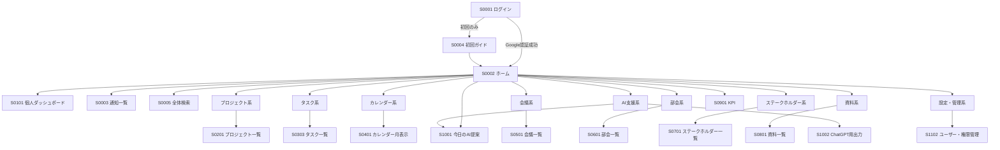
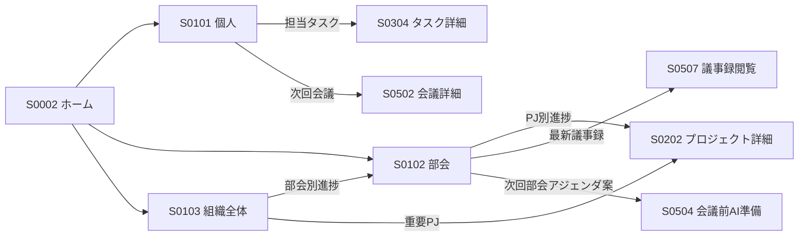
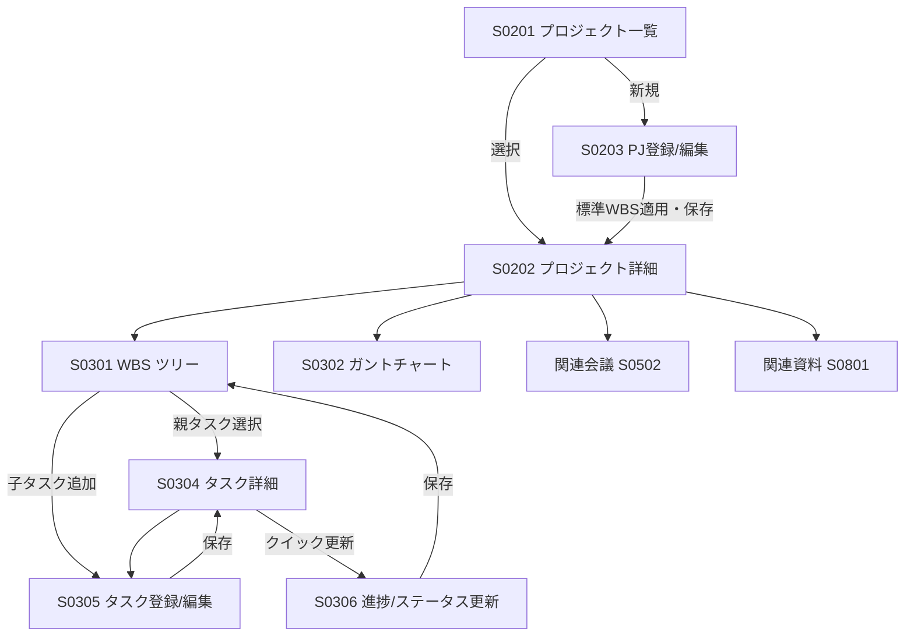
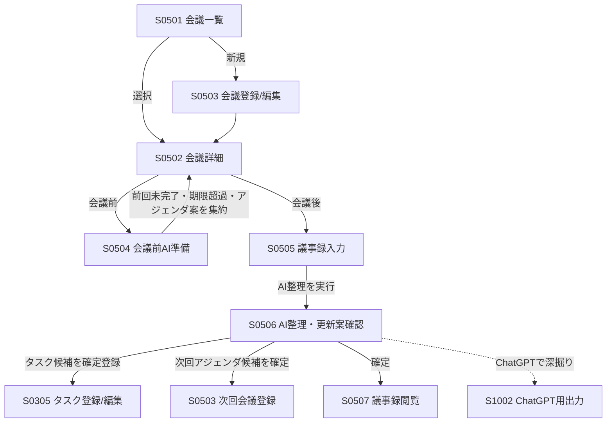
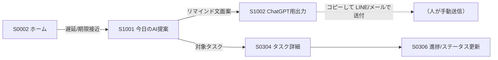
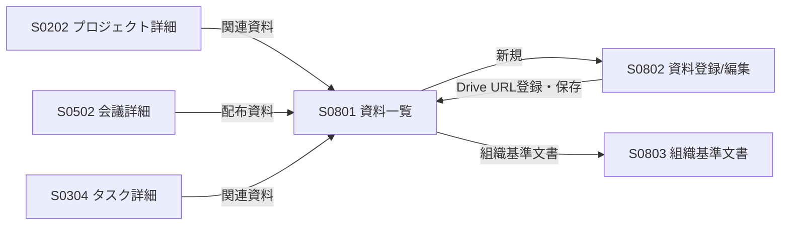
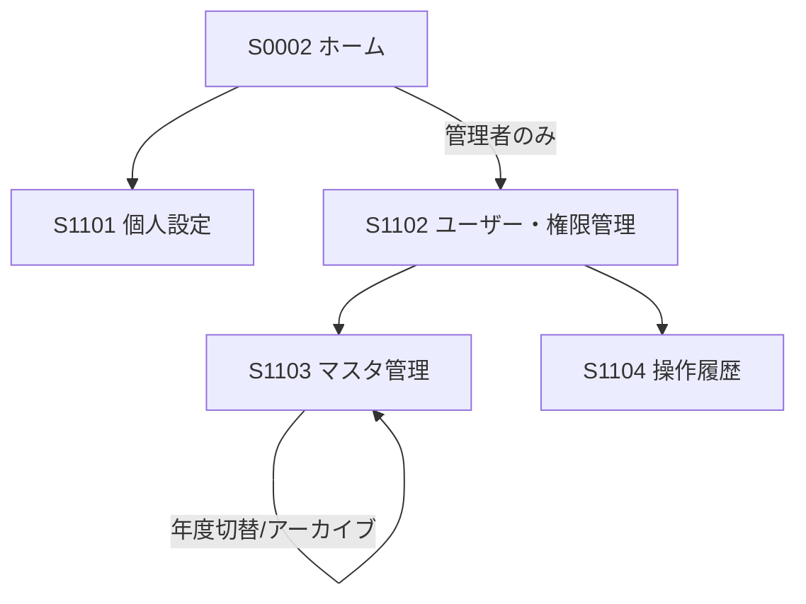
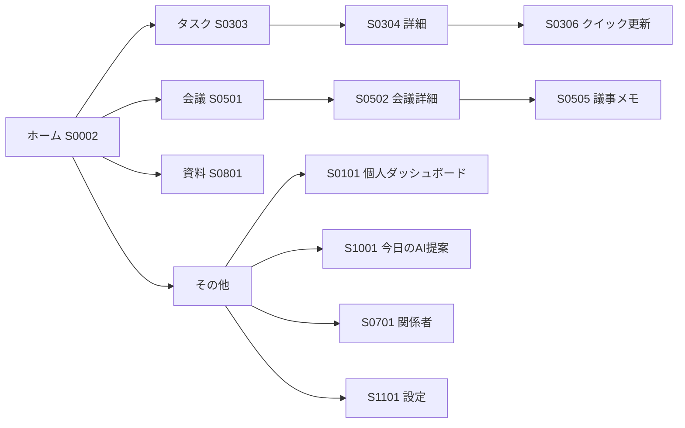

# やとアカ運営AI-PMOシステム 画面遷移図

- **対象版数**: 第0.1版準拠
- **記法**: Mermaid（GitHub上でそのまま図として表示される）
- **参照**: 画面IDは[画面一覧](01_画面一覧.md)に準拠

---

## 1．全体遷移図（トップレベル）

ログイン後はホーム（S0002）を起点に、PCは左メニュー、スマートフォンは下部メニューから各機能へ遷移する。

---

## 2．ダッシュボード遷移

権限により表示可能なダッシュボードが変わる（部会メンバー＝個人のみ／部会長＝個人＋部会／理事＝全て）。

---

## 3．プロジェクト → WBS → タスク遷移

進捗更新（S0306）で子タスクの進捗率を変更すると、親タスク・プロジェクト・部会・全体の進捗率が自動で再計算され、各ダッシュボードへ反映される。

---

## 4．会議 → 議事録 → タスク化 遷移（AI支援の中核フロー）

- **会議前**: S0504 が前回議事録・未完了タスク・期限超過・年間計画上の論点からアジェンダ案を提示。
- **会議後**: S0505 で議事録を入力 → S0506 でAIが「要約／決定事項／新規タスク候補／担当者候補／期限候補／次回アジェンダ候補／WBS更新候補」を**更新案**として提示 → 人が確認して確定。
- AIは自動確定しない（要件定義書 2.3）。確定操作は必ず人が行う。

---

## 5．リマインド → タスク対応 遷移

AIはリマインド文面を作成するのみで、自動送信はしない（要件定義書 5.5）。

---

## 6．資料・ナレッジ遷移

資料の実体は Google Drive に置き、システムでは URL とメタ情報（分類・年度・部会・PJ・公開範囲・版区分）を管理する。

---

## 7．管理・設定遷移（システム管理者）

---

## 8．スマートフォン下部メニュー遷移

スマートフォンはガントチャート（S0302）や一括編集等のPC向け機能を省き、確認・更新中心の導線とする。

---

## 9．画面遷移の設計原則

要件定義書「7.3 操作性」に基づく。

- 主要操作（タスク完了・進捗更新・議事録入力）は**ホームから3クリック以内**で到達できること。
- どの詳細画面からも、上位（プロジェクト・部会・会議）へ**パンくず**で戻れること。
- 一覧 → 詳細 → 編集 → 一覧へ戻る、の往復を基本パターンとする。
- AIが生成した内容へ遷移した場合は、必ず「確認 → 確定」の1ステップを挟む。
