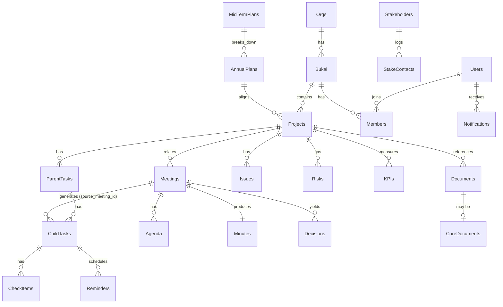

# やとアカ運営AI-PMOシステム データベース設計（項目定義）

- **対象版数**: 第0.1版準拠
- **初期DB**: Googleスプレッドシート（1シート＝1テーブル）
- **設計方針**: 将来的な独自Web App／Firebase／PostgreSQL への移行を見据え、正規化された関係構造で設計する（要件定義書 9.2）
- **列アクセス規約**: Apps Script からの列参照は必ず**列名（ヘッダー行）基準**とし、列インデックスのハードコードは禁止する

---

## 1．共通設計ルール

### 1.1 共通列（全テーブルに付与）

| 列名 | 型 | 説明 |
| --- | --- | --- |
| `id` | 文字列 | 主キー。テーブル別プレフィックス＋連番（例 `PJ0007`） |
| `created_at` | 日時 | 作成日時 |
| `created_by` | 文字列 | 作成者ユーザーID |
| `updated_at` | 日時 | 最終更新日時 |
| `updated_by` | 文字列 | 更新者ユーザーID |
| `is_archived` | 真偽 | アーカイブ済みフラグ（物理削除せず論理削除）|
| `fiscal_year` | 文字列 | 対象年度（例 `2026`）。年度切替・アーカイブ用 |

> **削除の原則**: 完全削除ではなくアーカイブを基本とする（要件定義書 10）。`is_archived = TRUE` で一覧から除外する。

### 1.2 ID体系（プレフィックス）

| テーブル | プレフィックス | 例 |
| --- | --- | --- |
| ユーザー | `U` | `U0001` |
| 組織 | `ORG` | `ORG01` |
| 部会 | `BK` | `BK01`（イベント部会）|
| プロジェクト | `PJ` | `PJ0007` |
| 親タスク | `PT` | `PT0042` |
| 子タスク | `CT` | `CT0311` |
| 会議 | `MTG` | `MTG0105` |
| アジェンダ | `AG` | `AG0230` |
| 議事録 | `MIN` | `MIN0105` |
| 決定事項 | `DEC` | `DEC0450` |
| 課題 | `ISS` | `ISS0120` |
| リスク | `RSK` | `RSK0033` |
| KPI | `KPI` | `KPI0015` |
| ステークホルダー | `STK` | `STK0022` |
| 資料 | `DOC` | `DOC0680` |
| コメント | `CMT` | `CMT1024` |
| 通知 | `NTF` | `NTF3300` |
| リマインド | `RMD` | `RMD0090` |
| 年度計画 | `AP` | `AP2026` |
| 中期計画 | `MP` | `MP01` |
| 組織基準文書 | `CORE` | `CORE003` |

### 1.3 選択肢（Enum）はマスタ管理

ステータス・優先度・分類等の選択肢は、プログラム修正なしで変更できるよう `M_選択肢` マスタで一元管理する（要件定義書 11.5）。

---

## 2．テーブル一覧（全21テーブル ＋ マスタ／履歴）

| # | シート名 | テーブル | 主な役割 |
| --- | --- | --- | --- |
| 1 | `Users` | ユーザー | ログイン利用者 |
| 2 | `Orgs` | 組織 | 組織基本情報（通常1件）|
| 3 | `Bukai` | 部会 | 部会（イベント部会 等）|
| 4 | `Members` | 所属（兼任） | ユーザー×部会×役職の中間テーブル |
| 5 | `Projects` | プロジェクト | プロジェクト |
| 6 | `ParentTasks` | 親タスク | WBS 親タスク |
| 7 | `ChildTasks` | 子タスク | WBS 子タスク |
| 8 | `CheckItems` | チェック項目 | 子タスク配下の任意チェック |
| 9 | `Meetings` | 会議 | 会議 |
| 10 | `Agenda` | アジェンダ | 会議×議題 |
| 11 | `Minutes` | 議事録 | 会議に紐づく議事録 |
| 12 | `Decisions` | 決定事項 | 会議での決定 |
| 13 | `Issues` | 課題 | 未解決課題 |
| 14 | `Risks` | リスク | プロジェクトリスク |
| 15 | `KPIs` | KPI | 部会/PJ別KPI |
| 16 | `Stakeholders` | ステークホルダー | 外部関係者 |
| 17 | `StakeContacts` | 対応履歴 | ステークホルダー接触記録 |
| 18 | `Documents` | 資料 | Drive資料メタ情報 |
| 19 | `CoreDocuments` | 組織基準文書 | 定款・理念・中期計画等 |
| 20 | `Comments` | コメント | 汎用コメント（対象を型＋IDで指定）|
| 21 | `Notifications` | 通知 | システム内通知 |
| 22 | `Reminders` | リマインド | リマインド設定・対象 |
| 23 | `AnnualPlans` | 年度計画 | 年度方針・重点目標 |
| 24 | `MidTermPlans` | 中期計画 | 中長期計画 |
| — | `M_選択肢` | マスタ | Enum（ステータス等）|
| — | `AuditLog` | 操作履歴 | 監査ログ |

---

## 3．テーブル項目定義

以下、共通列（1.1）は各テーブルで省略して記載する。

### 3.1 Users（ユーザー）

| 列名 | 型 | 必須 | 説明 |
| --- | --- | :-: | --- |
| `email` | 文字列 | ○ | Googleアカウント（ログインキー）|
| `name` | 文字列 | ○ | 氏名 |
| `role_global` | 選択 | ○ | システム権限：管理者/理事長/理事/事務局/部会長/部会メンバー/行政関係者/閲覧者 |
| `title` | 文字列 |  | 役職名（自由記述）|
| `status` | 選択 | ○ | 有効/停止（退任・退職時に停止）|
| `phone` | 文字列 |  | 連絡先（任意・権限限定表示）|

### 3.2 Bukai（部会）

| 列名 | 型 | 必須 | 説明 |
| --- | --- | :-: | --- |
| `name` | 文字列 | ○ | 部会名（例：イベント部会）|
| `description` | 文字列 |  | 部会の役割 |
| `leader_user_id` | FK(Users) |  | 部会長 |
| `sub_leader_user_id` | FK(Users) |  | 副部会長 |
| `display_order` | 数値 |  | 表示順 |

### 3.3 Members（所属・兼任）

一人が複数部会を兼任できるようにするための中間テーブル。

| 列名 | 型 | 必須 | 説明 |
| --- | --- | :-: | --- |
| `user_id` | FK(Users) | ○ | 対象ユーザー |
| `bukai_id` | FK(Bukai) | ○ | 所属部会 |
| `role_in_bukai` | 選択 | ○ | 部会長/副部会長/メンバー |
| `can_view` | 真偽 | ○ | 閲覧権限 |
| `can_edit` | 真偽 | ○ | 編集権限 |
| `can_approve` | 真偽 | ○ | 承認権限 |
| `notify_target` | 真偽 | ○ | 通知対象か |

### 3.4 Projects（プロジェクト）

| 列名 | 型 | 必須 | 説明 |
| --- | --- | :-: | --- |
| `name` | 文字列 | ○ | プロジェクト名 |
| `bukai_id` | FK(Bukai) | ○ | 所属部会 |
| `owner_user_id` | FK(Users) | ○ | 責任者 |
| `member_user_ids` | FK配列 |  | 参加メンバー（カンマ区切り）|
| `purpose` | 文字列 |  | 目的 |
| `background` | 文字列 |  | 背景 |
| `target_audience` | 文字列 |  | 対象者 |
| `start_date` | 日付 |  | 開始日 |
| `end_date` | 日付 |  | 終了予定日 |
| `status` | 選択 | ○ | 未着手/進行中/完了/保留/中止 |
| `priority` | 選択 |  | 高/中/低 |
| `progress` | 数値 |  | 進捗率（0-100、子から自動算出）|
| `budget` | 数値 |  | 予算 |
| `midterm_plan_id` | FK(MidTermPlans) |  | 関連する中期目標 |
| `annual_plan_id` | FK(AnnualPlans) |  | 関連する年度計画 |

> 関連資料・会議・ステークホルダー・リスク・課題・決定事項は各テーブル側から `project_id` で参照する（1対多）。

### 3.5 ParentTasks（親タスク）

| 列名 | 型 | 必須 | 説明 |
| --- | --- | :-: | --- |
| `name` | 文字列 | ○ | 親タスク名 |
| `project_id` | FK(Projects) | ○ | 所属プロジェクト |
| `bukai_id` | FK(Bukai) | ○ | 所属部会（非正規化・絞り込み高速化）|
| `order` | 数値 |  | WBS表示順 |
| `status` | 選択 | ○ | 未着手/対応中/確認待ち/承認待ち/保留/完了/中止 |
| `progress` | 数値 |  | 進捗率（子タスクから自動算出）|
| `progress_calc_method` | 選択 | ○ | 単純平均/重み付け平均/完了数（初期=単純平均）|

### 3.6 ChildTasks（子タスク）

WBS の実作業単位。要件定義書 5.3 のタスク管理項目を保持する。

| 列名 | 型 | 必須 | 説明 |
| --- | --- | :-: | --- |
| `name` | 文字列 | ○ | タスク名 |
| `parent_task_id` | FK(ParentTasks) | ○ | 親タスク |
| `project_id` | FK(Projects) | ○ | 所属プロジェクト（非正規化）|
| `bukai_id` | FK(Bukai) | ○ | 所属部会（非正規化）|
| `assignee_user_id` | FK(Users) |  | 担当者 |
| `collaborator_user_ids` | FK配列 |  | 協力者 |
| `start_date` | 日付 |  | 開始日 |
| `due_date` | 日付 |  | 期限 |
| `priority` | 選択 |  | 高/中/低 |
| `status` | 選択 | ○ | 未着手/対応中/確認待ち/承認待ち/保留/完了/中止 |
| `progress` | 数値 | ○ | 進捗率（0-100）|
| `weight` | 数値 |  | 重み（重み付け平均時に使用、既定1）|
| `completion_criteria` | 文字列 |  | 完了条件 |
| `deliverable` | 文字列 |  | 成果物 |
| `depends_on_task_ids` | FK配列 |  | 依存タスク |
| `reminder_offsets` | 文字列 |  | リマインド日数（例 `30,14,7,3,1,0`）|
| `source_meeting_id` | FK(Meetings) |  | 議事録から生成された場合の出典会議 |

### 3.7 CheckItems（チェック項目）

| 列名 | 型 | 必須 | 説明 |
| --- | --- | :-: | --- |
| `child_task_id` | FK(ChildTasks) | ○ | 親の子タスク |
| `label` | 文字列 | ○ | チェック内容 |
| `is_done` | 真偽 | ○ | 完了フラグ |
| `order` | 数値 |  | 表示順 |

### 3.8 Meetings（会議）

| 列名 | 型 | 必須 | 説明 |
| --- | --- | :-: | --- |
| `name` | 文字列 | ○ | 会議名 |
| `type` | 選択 | ○ | 総会/理事会/部会/PJ会議/行政打合せ/外部打合せ/振り返り |
| `purpose` | 文字列 |  | 開催目的 |
| `start_at` | 日時 | ○ | 開催日時 |
| `location` | 文字列 |  | 場所／オンラインURL |
| `attendee_user_ids` | FK配列 |  | 参加者 |
| `organizer_user_id` | FK(Users) |  | 主催者 |
| `minutes_taker_user_id` | FK(Users) |  | 議事録担当者 |
| `bukai_id` | FK(Bukai) |  | 関連部会 |
| `project_id` | FK(Projects) |  | 関連プロジェクト |
| `related_task_ids` | FK配列 |  | 関連タスク |
| `prev_meeting_id` | FK(Meetings) |  | 前回会議 |
| `next_meeting_id` | FK(Meetings) |  | 次回会議 |
| `status` | 選択 | ○ | 予定/開催済/中止 |

### 3.9 Agenda（アジェンダ）

| 列名 | 型 | 必須 | 説明 |
| --- | --- | :-: | --- |
| `meeting_id` | FK(Meetings) | ○ | 対象会議 |
| `order` | 数値 | ○ | 議題順 |
| `topic` | 文字列 | ○ | 議題 |
| `objective` | 文字列 |  | 議題の目的 |
| `check_points` | 文字列 |  | 確認事項 |
| `decision_needed` | 文字列 |  | 必要な決定 |
| `ref_document_ids` | FK配列 |  | 参照資料 |
| `est_minutes` | 数値 |  | 想定時間（分）|
| `related_task_ids` | FK配列 |  | 関係タスク |
| `speaker_user_id` | FK(Users) |  | 発言・説明担当候補 |
| `source` | 選択 | ○ | 人手/AI提案 |
| `is_confirmed` | 真偽 | ○ | AI提案を人が確定したか |

### 3.10 Minutes（議事録）

| 列名 | 型 | 必須 | 説明 |
| --- | --- | :-: | --- |
| `meeting_id` | FK(Meetings) | ○ | 対象会議 |
| `raw_text` | 文字列 |  | 議事録担当者の自由記述 |
| `summary` | 文字列 |  | AI要約（人が確認）|
| `body` | 文字列 |  | テンプレート整形後の本文 |
| `doc_url` | 文字列 |  | Googleドキュメントの正式版URL |
| `status` | 選択 | ○ | 下書き/確定 |
| `next_agenda_draft` | 文字列 |  | 次回アジェンダ候補（AI生成・要確認）|

### 3.11 Decisions（決定事項）

| 列名 | 型 | 必須 | 説明 |
| --- | --- | :-: | --- |
| `meeting_id` | FK(Meetings) |  | 出典会議 |
| `project_id` | FK(Projects) |  | 関連プロジェクト |
| `content` | 文字列 | ○ | 決定内容 |
| `decided_date` | 日付 |  | 決定日 |
| `status` | 選択 | ○ | 決定/保留/継続審議 |

### 3.12 Issues（課題） / 3.13 Risks（リスク）

| 列名 | 型 | 必須 | 説明 |
| --- | --- | :-: | --- |
| `project_id` | FK(Projects) |  | 関連プロジェクト |
| `bukai_id` | FK(Bukai) |  | 関連部会 |
| `title` | 文字列 | ○ | 課題／リスク名 |
| `description` | 文字列 |  | 内容 |
| `owner_user_id` | FK(Users) |  | 対応担当 |
| `due_date` | 日付 |  | 対応期限（課題）|
| `severity` | 選択 |  | 高/中/低（リスク）|
| `likelihood` | 選択 |  | 高/中/低（リスク）|
| `status` | 選択 | ○ | オープン/対応中/解決/クローズ |

### 3.14 KPIs（KPI）

| 列名 | 型 | 必須 | 説明 |
| --- | --- | :-: | --- |
| `name` | 文字列 | ○ | KPI名 |
| `bukai_id` | FK(Bukai) |  | 対象部会 |
| `project_id` | FK(Projects) |  | 対象プロジェクト |
| `target_value` | 数値 |  | 目標値 |
| `current_value` | 数値 |  | 現在値 |
| `unit` | 文字列 |  | 単位 |
| `annual_plan_id` | FK(AnnualPlans) |  | 関連年度目標 |

### 3.15 Stakeholders（ステークホルダー）

| 列名 | 型 | 必須 | 説明 |
| --- | --- | :-: | --- |
| `org_name` | 文字列 | ○ | 組織名 |
| `category` | 選択 | ○ | 弥富市役所/教育委員会/学校/教職員/保護者/生徒/地域団体/指導者/地域企業/協賛企業/施設/競技文化団体/メディア/その他 |
| `contact_name` | 文字列 |  | 担当者名 |
| `contact_title` | 文字列 |  | 役職 |
| `contact_info` | 文字列 |  | 連絡先（権限限定）|
| `related_project_ids` | FK配列 |  | 関係プロジェクト |
| `owner_director_id` | FK(Users) |  | やとアカ側担当理事 |
| `relationship` | 文字列 |  | 関係性 |
| `understanding_level` | 選択 |  | 理解度：高/中/低 |
| `cooperation_level` | 選択 |  | 協力度：高/中/低 |
| `current_request` | 文字列 |  | 現在の依頼事項 |
| `their_request` | 文字列 |  | 相手側からの要望 |
| `last_contact_date` | 日付 |  | 最終面談日 |
| `next_contact_date` | 日付 |  | 次回接触予定 |
| `next_materials` | 文字列 |  | 次回提示資料 |
| `notes` | 文字列 |  | 注意事項 |
| `status` | 選択 | ○ | 対応ステータス（対応中/回答待ち/完了 等）|

### 3.16 StakeContacts（対応履歴）

| 列名 | 型 | 必須 | 説明 |
| --- | --- | :-: | --- |
| `stakeholder_id` | FK(Stakeholders) | ○ | 対象関係者 |
| `contact_date` | 日付 | ○ | 接触日 |
| `summary` | 文字列 | ○ | 打合せ内容 |
| `meeting_id` | FK(Meetings) |  | 関連議事録 |
| `provided_document_ids` | FK配列 |  | 提供済み資料 |

### 3.17 Documents（資料）

| 列名 | 型 | 必須 | 説明 |
| --- | --- | :-: | --- |
| `name` | 文字列 | ○ | 文書名 |
| `category` | 選択 | ○ | 文書分類（M_選択肢で管理）|
| `drive_url` | 文字列 | ○ | Google DriveのURL |
| `author` | 文字列 |  | 作成者 |
| `target_year` | 文字列 |  | 対象年度 |
| `bukai_id` | FK(Bukai) |  | 対象部会 |
| `project_id` | FK(Projects) |  | 対象プロジェクト |
| `visibility` | 選択 | ○ | 公開範囲（全体/部会/理事/管理者）|
| `version_type` | 選択 | ○ | 正式版/下書き |
| `validity` | 選択 | ○ | 有効/廃止 |
| `related_goal` | 文字列 |  | 関連する組織目標 |

### 3.18 CoreDocuments（組織基準文書）

定款・理念・中期計画等。AIが提案時に優先参照する（要件定義書 5.9）。

| 列名 | 型 | 必須 | 説明 |
| --- | --- | :-: | --- |
| `document_id` | FK(Documents) | ○ | 実体資料 |
| `core_type` | 選択 | ○ | 定款/理念/ミッション/ビジョン/中期計画/事業計画/年度方針 |
| `priority_order` | 数値 |  | AI参照優先度 |
| `is_active` | 真偽 | ○ | 現行版か |

### 3.19 Comments（コメント・汎用）

| 列名 | 型 | 必須 | 説明 |
| --- | --- | :-: | --- |
| `target_type` | 選択 | ○ | 対象種別（Task/Meeting/Project/Stakeholder 等）|
| `target_id` | 文字列 | ○ | 対象ID |
| `body` | 文字列 | ○ | 本文 |
| `mention_user_ids` | FK配列 |  | メンション先 |

### 3.20 Notifications（通知） / 3.21 Reminders（リマインド）

**Notifications**

| 列名 | 型 | 必須 | 説明 |
| --- | --- | :-: | --- |
| `to_user_id` | FK(Users) | ○ | 宛先 |
| `type` | 選択 | ○ | メンション/承認待ち/期限/AI提案 |
| `target_type` | 選択 |  | 対象種別 |
| `target_id` | 文字列 |  | 対象ID |
| `message` | 文字列 | ○ | 通知本文 |
| `is_read` | 真偽 | ○ | 既読フラグ |

**Reminders**

| 列名 | 型 | 必須 | 説明 |
| --- | --- | :-: | --- |
| `task_id` | FK(ChildTasks) | ○ | 対象タスク |
| `remind_date` | 日付 | ○ | リマインド発火日 |
| `offset_days` | 数値 | ○ | 期限からの日数（30/14/7/3/1/0/超過）|
| `channel` | 選択 | ○ | システム内/メール/文面出力 |
| `is_sent` | 真偽 | ○ | 送付済みか（手動送付含む）|
| `ai_message_draft` | 文字列 |  | AI生成の文面案 |

### 3.22 AnnualPlans（年度計画） / 3.23 MidTermPlans（中期計画）

| 列名 | 型 | 必須 | 説明 |
| --- | --- | :-: | --- |
| `title` | 文字列 | ○ | 計画・方針名 |
| `year` | 文字列 |  | 対象年度（年度計画）|
| `period` | 文字列 |  | 対象期間（中期計画、例 2026-2028）|
| `goals` | 文字列 |  | 重点目標 |
| `midterm_plan_id` | FK(MidTermPlans) |  | 親の中期計画（年度計画のみ）|
| `core_document_id` | FK(CoreDocuments) |  | 根拠となる基準文書 |

### 3.24 AuditLog（操作履歴）

要件定義書 10・11.3。誰がいつ何を変更したかを記録する。

| 列名 | 型 | 必須 | 説明 |
| --- | --- | :-: | --- |
| `at` | 日時 | ○ | 操作日時 |
| `user_id` | FK(Users) | ○ | 操作者 |
| `action` | 選択 | ○ | create/update/delete(archive)/login |
| `target_type` | 選択 | ○ | 対象テーブル |
| `target_id` | 文字列 | ○ | 対象ID |
| `diff` | 文字列 |  | 変更内容（前→後の要約）|

---

## 4．リレーション概要（ER図）

---

## 5．進捗率ロールアップの計算仕様

要件定義書 5.3。親→上位へ自動集計する。

1. **親タスク進捗** ＝ `progress_calc_method` に従い子タスク進捗から算出
   - 単純平均（初期既定）: `Σ(子progress) / 子件数`
   - 重み付け平均: `Σ(子progress × weight) / Σ(weight)`
   - 完了数: `完了した子件数 / 子件数 × 100`
2. **プロジェクト進捗** ＝ 親タスク進捗の平均（親に重みを持たせる拡張も可）
3. **部会進捗** ＝ 部会内プロジェクト進捗の平均
4. **組織全体進捗** ＝ 全部会進捗の平均

> 計算方式は将来変更されうるため（要件定義書 18-4）、`progress_calc_method` をタスク単位で保持し、マスタ既定値を管理画面から変更できるようにする。

---

## 6．移行を見据えた設計上の注意

- FK配列（カンマ区切り）はスプレッドシート運用の便宜。将来のRDB移行時は中間テーブルへ展開する（例：`related_task_ids` → `meeting_tasks`）。移行しやすいよう、配列列は必ず ID のみを格納し表示名は持たせない。
- Enum は `M_選択肢` に集約し、コード（不変）と表示名（可変）を分離する。
- すべての日付・日時は ISO 8601（`YYYY-MM-DD` / `YYYY-MM-DDTHH:mm`）で保存する。
- 年度切替時は `fiscal_year` で絞り込み、過年度は `is_archived` ではなく年度フィルタでアーカイブ表示する。
