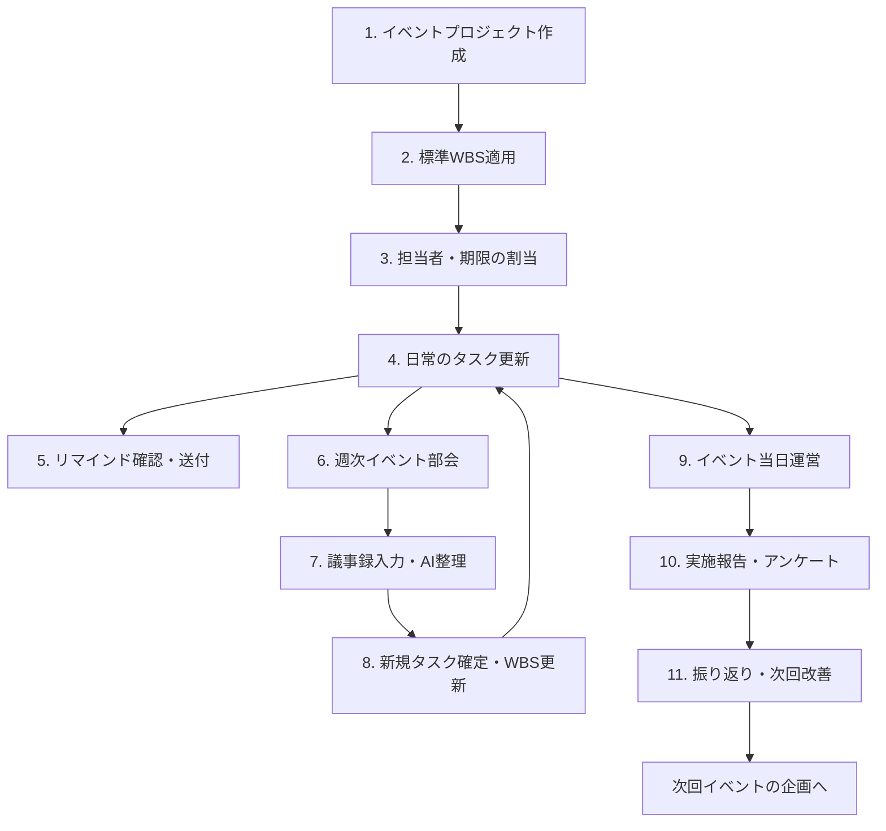
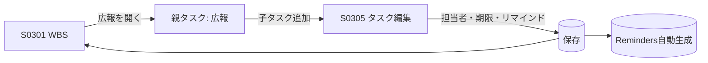
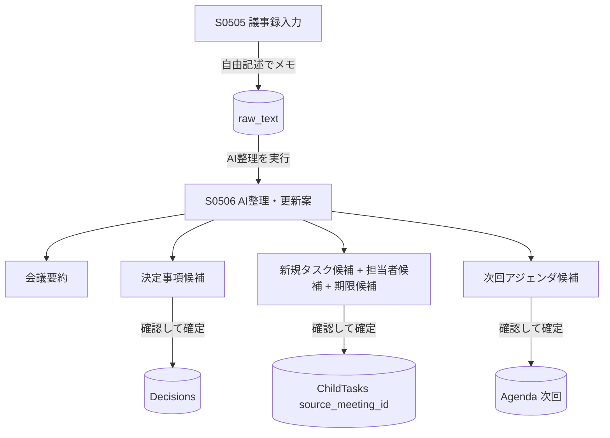

# イベント部会 具体的な操作フロー（先行導入）

- **対象版数**: 第0.1版準拠
- **対象**: 先行導入対象であるイベント部会（要件定義書 3.3 / 6）
- **目的**: 実際の1イベントを題材に「登録 → タスク運用 → 会議 → 議事録 → 次回改善」の一連の操作を具体化する
- **参照**: [画面一覧](01_画面一覧.md) / [画面遷移図](02_画面遷移図.md) / [データベース設計](03_データベース設計.md)

---

## 1．登場人物（ロール）

| ロール | 例 | 主な操作 |
| --- | --- | --- |
| イベント部会長 | 部会の進行管理者 | プロジェクト作成・進捗確認・アジェンダ確定 |
| 実行メンバー | 会場・広報・受付 等の担当者 | 自タスクの進捗更新・コメント |
| 事務局 | 事務担当 | 会議登録・議事録整形・リマインド送付 |
| 理事 | 監督者 | 全体進捗の閲覧 |

---

## 2．全体フロー（イベント1件のライフサイクル）



---

## 3．ステップ別 操作手順

### ステップ1・2：イベントプロジェクトの作成と標準WBS適用

**操作画面**: S0201 プロジェクト一覧 → S0203 プロジェクト登録

1. 部会長が「プロジェクト」→「新規」を押す。
2. イベント基本情報を入力する（要件定義書 6.1）。

   | 項目 | 入力例 |
   | --- | --- |
   | プロジェクト名 | 2026 夏 キックオフ体験会 |
   | 所属部会 | イベント部会 |
   | 責任者 | （部会長）|
   | 目的 | 地域展開の周知と部活動体験機会の提供 |
   | 対象者 | 市内中学生・保護者 |
   | 開催日（終了予定日） | 2026-08-24 |
   | 会場 | 弥富市総合体育館 |
   | 定員 | 120名 |
   | 予算 | 300,000円 |
   | 関連年度目標 | 2026年度：地域認知の拡大 |

3. 「標準WBSを適用」にチェックして保存すると、イベント標準の**15親タスク**が自動生成される（`ParentTasks` に一括作成）。

**自動生成される親タスク（要件定義書 6.2）**

```
1. 企画          2. 会場          3. 出演・講師・指導者
4. 行政・教育委員会調整   5. 広報      6. 申込受付
7. 備品          8. スタッフ配置   9. 安全管理
10. 当日運営      11. 会計         12. アンケート
13. 実施報告     14. 振り返り     15. 次回改善
```

> データ的には `Projects` に1件、`ParentTasks` に15件が `progress_calc_method = 単純平均` で作成される。

### ステップ3：子タスクと担当者・期限の割当

**操作画面**: S0301 WBS → S0305 タスク登録

1. 親タスク「広報」を開き、子タスクを追加する。

   例（要件定義書 5.3 の広報WBSに準拠）：

   | 子タスク | 担当者 | 期限 | リマインド |
   | --- | --- | --- | --- |
   | チラシ原稿作成 | Aさん | 2026-07-20 | 14,7,3,1,0 |
   | 教育委員会確認 | 事務局 | 2026-07-25 | 7,3,1,0 |
   | 印刷 | Aさん | 2026-08-01 | 7,3,1 |
   | 配布 | Bさん | 2026-08-10 | 7,3,1,0 |

2. 保存すると、各子タスクに応じて `Reminders` レコードが自動生成される（期限日 − offset で発火日を計算）。
3. 担当者が未設定の子タスクは、後述の「今日のAI提案」で自動的に指摘される。



### ステップ4：日常のタスク更新（スマートフォン中心）

**操作画面**: S0002 ホーム → S0304 タスク詳細 → S0306 クイック更新

1. 実行メンバーはスマートフォンで「ホーム」を開くと、**今日やること／今週の期限／遅れていること**が表示される。
2. 担当タスクをタップ → 進捗率スライダーとステータスを**1画面で**更新（片手操作）。
3. 子タスクの進捗を更新すると、親タスク「広報」→ プロジェクト → 部会 → 全体の進捗率が自動再計算される（[DB設計 §5](03_データベース設計.md)）。

> 目標：ホームから**3クリック以内**でタスク完了まで到達する（要件定義書 7.3）。

### ステップ5：リマインド確認と送付（AIは文面作成のみ）

**操作画面**: S1001 今日のAI提案 → S1002 ChatGPT用出力

1. 期限が近い／進捗が低いタスクを、システムが「今日のAI提案」に抽出する。
2. 事務局がリマインド対象を開くと、AIが文面案を生成する。

   ```
   【リマインド案】チラシ原稿作成（担当：Aさん）
   期限：7/20（あと3日） 現在の進捗：40%
   未完了：デザイン確定、教育委員会向け文言確認
   次の作業：ドラフトを部会長へ共有し、7/18までに確認をもらう
   ─ 送付文面案 ─
   Aさん、お疲れさまです。チラシ原稿の期限が7/20に迫っています。…
   ```

3. 事務局が内容を確認し、**LINE／メールへ手動でコピーして送付**する。
   - AIは自動送信しない（要件定義書 5.5）。`Reminders.is_sent` を手動で完了にする。

### ステップ6・7：週次イベント部会と議事録

**操作画面**: S0503 会議登録 → S0504 会議前AI準備 → S0505 議事録入力 → S0506 AI整理

#### 会議前

1. 事務局が週次部会を `Meetings`（type=部会）に登録し、前回会議を `prev_meeting_id` で紐付ける。
2. S0504（会議前AI準備）を開くと、AIが以下を自動集約する。
   - 前回の決定事項・未完了タスク・期限超過タスク
   - 年間計画上この時期に決めるべき事項
   - 次回アジェンダ案（`Agenda` に `source=AI提案 / is_confirmed=false` で仮登録）
3. 部会長がアジェンダ案を確認し、採用するものを確定（`is_confirmed=true`）。

#### 会議後



1. 議事録担当者は S0505 で共通テンプレート（要件定義書 5.7 の14項目）または自由記述で入力する。
2. 「AI整理」を押すと、S0506 で要約・決定事項・**新規タスク候補（担当者候補・期限候補付き）**・次回アジェンダ候補が**更新案**として並ぶ。
3. 人が1件ずつ確認して確定する。確定した新規タスクは `source_meeting_id` を持って WBS に追加され、議事録からのタスク漏れを防ぐ。
4. 議事録は確定すると `Minutes.status=確定`、Googleドキュメントの正式版URLを `doc_url` に登録する。

### ステップ8：WBS更新の反映

確定した新規タスクは自動的に該当親タスク配下に追加され、進捗率が再計算される。ステップ4の日常更新サイクルへ戻る。

### ステップ9：イベント当日運営

**操作画面**: S0102 イベント部会ダッシュボード

当日は部会ダッシュボードで以下を確認する（要件定義書 6.3）。

- 次回イベントまでの日数 / 全体進捗率 / 親タスク別進捗率
- **当日の未配置ポジション**（スタッフ配置の子タスクで担当者未設定を抽出）
- 行政確認待ち / 資料作成待ち / 遅延タスク / 予算執行状況

### ステップ10・11：実施報告・振り返りと次回改善

**操作画面**: S1003 AI振り返り支援 → S1002 ChatGPT用出力

1. 親タスク「12.アンケート」「13.実施報告」を完了へ更新する。
2. 「14.振り返り」で S1003 を使い、AIが以下を整理する（要件定義書 13.3）。
   - 良かった点 / 問題点 / 原因 / 次回改善 / 継続すること / 廃止すること / 新規タスク候補 / 他部会へ共有すべき事項
3. 「15.次回改善」で確定した改善タスクは、次回イベントプロジェクトの企画（ステップ1）へ引き継ぐ。
4. 必要に応じて S1002 で「年間振り返り作成用」「理事会向け月次報告作成用」のプロンプトを出力し、ChatGPTで報告資料を作成する。

---

## 4．ChatGPT用出力の使いどころ（イベント部会）

| 場面 | 出力テンプレート（S1002） | 含める情報 |
| --- | --- | --- |
| 週次部会前 | 次回会議アジェンダ作成用 | 前回議事録・未完了タスク・期限超過・年度計画 |
| 議事録作成後 | 議事録要約用 / タスク抽出用 | raw_text・WBS |
| 企画書づくり | イベント企画書作成用 | イベント基本情報・目的・KPI・理念 |
| 行政向け | 教育委員会向け報告資料作成用 | 実施報告・アンケート結果・組織基準文書 |
| 期末 | 年間振り返り作成用 | 決定事項・振り返り・KPI達成状況 |

出力はコピー用テキストとして表示し、利用者が ChatGPT に貼り付けて深掘りする（要件定義書 5.8）。API連携は初期段階では必須としない。

---

## 5．受入条件との対応（イベント部会での確認観点）

要件定義書「17．受入条件」を、本フローで確認できる。

| 受入条件 | 確認するステップ |
| --- | --- |
| イベント部会のプロジェクトが登録できる | ステップ1 |
| 親タスク・子タスクを作成できる | ステップ2・3 |
| 担当者と期限を設定できる | ステップ3 |
| 進捗率が親・部会・全体へ反映される | ステップ4 |
| 期限超過タスクが自動表示される | ステップ4・5 |
| 個人ごとの「今日やること」が表示される | ステップ4 |
| 会議と議事録が登録できる | ステップ6・7 |
| 前回議事録と未完了タスクから次回アジェンダ案を出力 | ステップ6 |
| ChatGPTへ貼り付けられる形式で出力できる | ステップ5・11・§4 |
| Drive資料をタスク・会議・PJへ関連付けられる | 各ステップ（S0802）|
| PC・スマホ両方で主要操作ができる | ステップ4（スマホ中心）|
| 部会長が部会全体の進捗を確認できる | ステップ9 |
| 理事が組織全体の進捗を確認できる | S0103 |
| 権限に応じて表示が制御される | 全ステップ（Membersの権限）|

---

## 6．運用定着のためのルール（要件定義書 7.6）

- **週次イベント部会では必ずシステム画面（S0102・S0301）を投影**して進行する。
- 会議の最後に「議事録AI整理 → 新規タスク確定」までを部会内で完了させる。
- タスクの入力担当を曖昧にしない（担当者未設定はAI提案で毎回指摘される）。
- 使わない機能は増やさず、イベント部会で定着してから他部会へ展開する。
